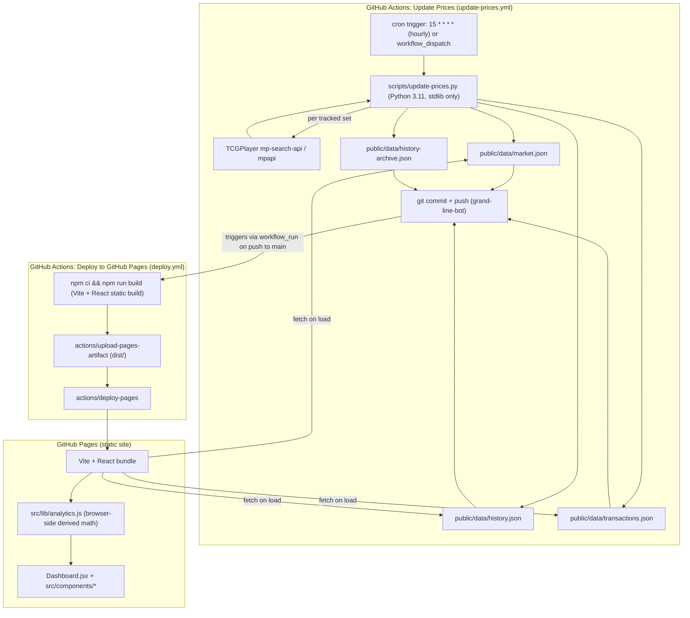
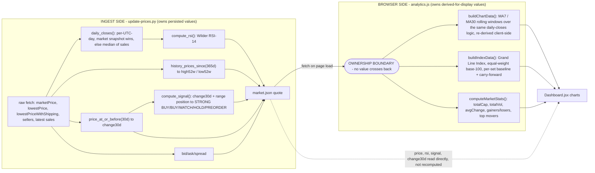

# Architecture

Grand Line Exchange has no backend and no database. Two GitHub Actions
workflows and a static Pages build are the entire system. This page adapts
the diagrams in [`docs/specs/`](https://github.com/caretak3r/grand-line-exchange/tree/main/docs/specs)
in the main repo — those render as live Mermaid diagrams on GitHub; the
blocks below are the same diagram source for reference here.

## Component diagram

Action → scraper → JSON → Pages → browser.

**Reading it:**

- `public/data/*.json` is written only by `scripts/update-prices.py`,
  committed by the bot user `grand-line-bot`, and read only by the browser
  bundle at load time. No other writer, no other reader.
- `update-prices.yml` and `deploy.yml` are loosely coupled — `deploy.yml`
  reacts to `workflow_run` completion of `Update Prices` (plus direct
  pushes to source paths).
- `release.yml` (tag-triggered GitHub Releases) and `ci.yml` (test/build
  gate on every push/PR) are not part of this runtime data flow — they
  never touch `public/data/` or the Pages deploy.

## The ownership rule (load-bearing)

Every value **persisted** in `public/data/market.json` — price, RSI,
signals, 52-week ranges, volumes — is computed once, at ingest, by
`scripts/update-prices.py`. Every value **derived for display only** —
moving averages, the Grand Line Index, market-pulse aggregates — is
computed in the browser by `src/lib/analytics.js`. No number is computed
on both sides.

| Value | Owner | Where |
|---|---|---|
| `price`, `bid`, `ask`, `spread` | ingest | `update-prices.py::main()` |
| `rsi` | ingest | `update-prices.py::compute_rsi()` |
| `signal`, `momentum` | ingest | `update-prices.py::compute_signal()` |
| `change30d`, `high52w`, `low52w` | ingest | `update-prices.py::main()` |
| `volume30d`, `soldLast7d` | ingest | `update-prices.py::history_sales_volume_since()` |
| Daily closes algorithm | **shared, independently reimplemented** | `daily_closes()` (Python) and `buildChartData()` (JS) |
| `ma7`, `ma30` | browser | `analytics.js::buildChartData()` |
| Grand Line Index | browser | `analytics.js::buildIndexData()` |
| `totalCap`, `totalVol`, `avgChange`, top movers | browser | `analytics.js::computeMarketStats()` |

<Callout type="info">
  The daily-closes *algorithm* (market snapshot wins, else median of sales)
  exists on both sides because RSI needs it at ingest time and the moving
  averages need it at render time — but the **output values never
  overlap**. This is the one deliberate exception to "compute it once,"
  and both sides are pinned by tests against the same fixture
  (`[95, 110, 84]` → MA `96.33`).
</Callout>

## Scrape cycle, in brief

Each hourly run: fetch per set (JSON `urllib` request, with a `curl`
subprocess fallback only for the latest-sales endpoint) → on failure, keep
the previous cached price rather than writing a zero or blank →
deduplicate new history rows via `history_row_key()` → prune rows whose
`YYYY-MM` bucket is older than 365 days into `history-archive.json`. Full
sequence diagram with source-line citations:
[`docs/specs/scrape-cycle-sequence.md`](https://github.com/caretak3r/grand-line-exchange/blob/main/docs/specs/scrape-cycle-sequence.md).

## Why it's built this way

Full reasoning for every structural decision — no backend, repo-as-database,
stdlib-only scraper, UTC-explicit timestamps, per-set/per-run resilience,
the ownership rule — lives in
[`docs/specs/decision-log.md`](https://github.com/caretak3r/grand-line-exchange/blob/main/docs/specs/decision-log.md).
The short version:

- **No backend** — GitHub Pages serves static files for free forever; a
  server would need hosting, uptime monitoring, and secrets this project
  doesn't need.
- **The repo is the database** — a plain `git commit` of JSON gives free
  versioning, hosting, and audit trail with zero new infrastructure.
- **Stdlib-only scraper** — zero install step on CI runners, and zero
  supply-chain surface for a workflow that holds `contents: write`.
- **UTC-explicit everywhere** — a scraper on a UTC runner and a browser in
  an arbitrary local timezone would otherwise bucket the same sale into
  different days, corrupting RSI and moving averages (a real bug class from
  earlier plans, not a hypothetical).
