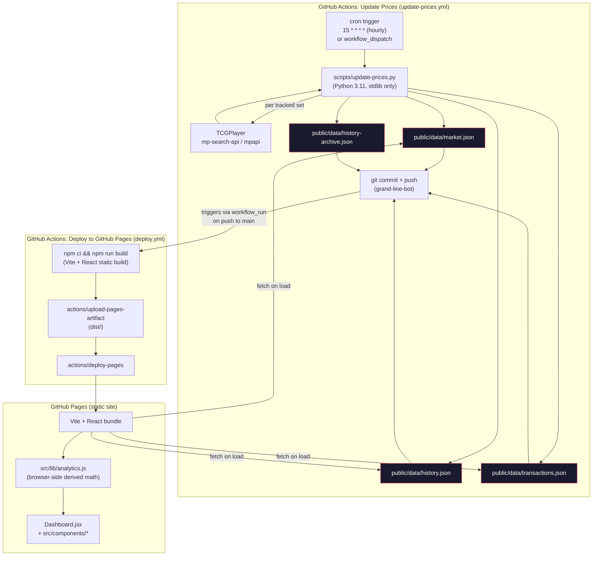

# Component Diagram

Grand Line Exchange has no backend and no database. The two GitHub Actions
workflows and the static Pages build are the entire system. This diagram
traces the components from `scripts/update-prices.py` (source of truth for
every persisted value) through to the browser.

## Reading the diagram

- **The repo is the database.** `public/data/*.json` is written only by
  `scripts/update-prices.py`, committed by the bot user `grand-line-bot`, and
  read only by the browser bundle at load time. No other writer, no reader
  outside the static site.
- **Two independent workflows, loosely coupled.** `update-prices.yml` doesn't
  know deploy exists; `deploy.yml` reacts to `workflow_run` completion of
  `Update Prices` (plus direct pushes to source paths) — see
  `.github/workflows/deploy.yml:6-13`.
- **`release.yml` is out of this loop.** It fires on `v*.*.*` tags only, reads
  git history, and writes a GitHub Release — it never touches `public/data/`
  or the Pages deploy. See `docs/specs/decision-log.md`.
- **A third workflow, `ci.yml`**, runs `npm test` + `pytest -q tests/` +
  `npm run build` on every push/PR to `main`; it isn't part of the runtime
  data flow, so it's omitted above.
