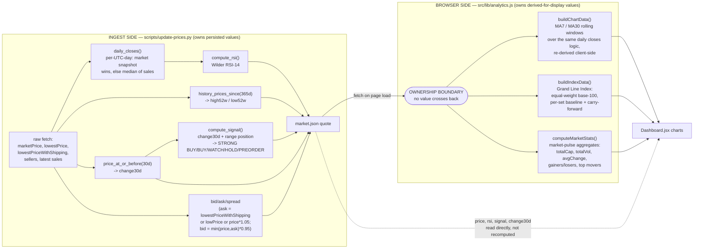

# Data-Flow Diagram: the Ownership Rule Boundary

CLAUDE.md calls this "load-bearing — violations get reverted": every value
**persisted** in `public/data/market.json` is computed once, at ingest, by
`scripts/update-prices.py`. Every value **derived for display only** is
computed in the browser by `src/lib/analytics.js`. No number is computed on
both sides. This diagram draws the boundary explicitly, field by field.

## What lives on which side

| Value | Owner | Where |
|---|---|---|
| `price`, `bid`, `ask`, `spread` | ingest | `update-prices.py::main()` |
| `rsi` | ingest | `update-prices.py::compute_rsi()` |
| `signal`, `momentum` | ingest | `update-prices.py::compute_signal()` |
| `change30d`, `high52w`, `low52w` | ingest | `update-prices.py::main()` via `price_at_or_before` / `history_prices_since` |
| `volume30d`, `soldLast7d` | ingest | `update-prices.py::history_sales_volume_since()` |
| Daily closes (market-wins-else-median-of-sales) | **shared algorithm, independently reimplemented on each side** | `update-prices.py::daily_closes()` (Python) and `analytics.js::buildChartData()` (JS) — see note below |
| `ma7`, `ma30` | browser | `analytics.js::buildChartData()` |
| Grand Line Index | browser | `analytics.js::buildIndexData()` |
| `totalCap`, `totalVol`, `avgChange`, gainers/losers, top movers | browser | `analytics.js::computeMarketStats()` |

**Note on daily-closes duplication:** the *algorithm* for turning raw
history rows into one price-per-UTC-day (market snapshot wins, else the
median of that day's sales) exists on both sides, because RSI needs it at
ingest time and the moving averages need it at render time — but the
**output values never overlap**: Python's closes feed only `rsi`
(persisted), JS's closes feed only `ma7`/`ma30` (display-only, never
written back to JSON). This is the one place the ownership rule pins the
*algorithm*, not the *number*, in two places; both sides are pinned by tests
against a shared fixture (see `README.md`'s daily-closes `[95, 110, 84]` →
MA `96.33` example) so a semantic drift on one side fails the other side's
suite too.
