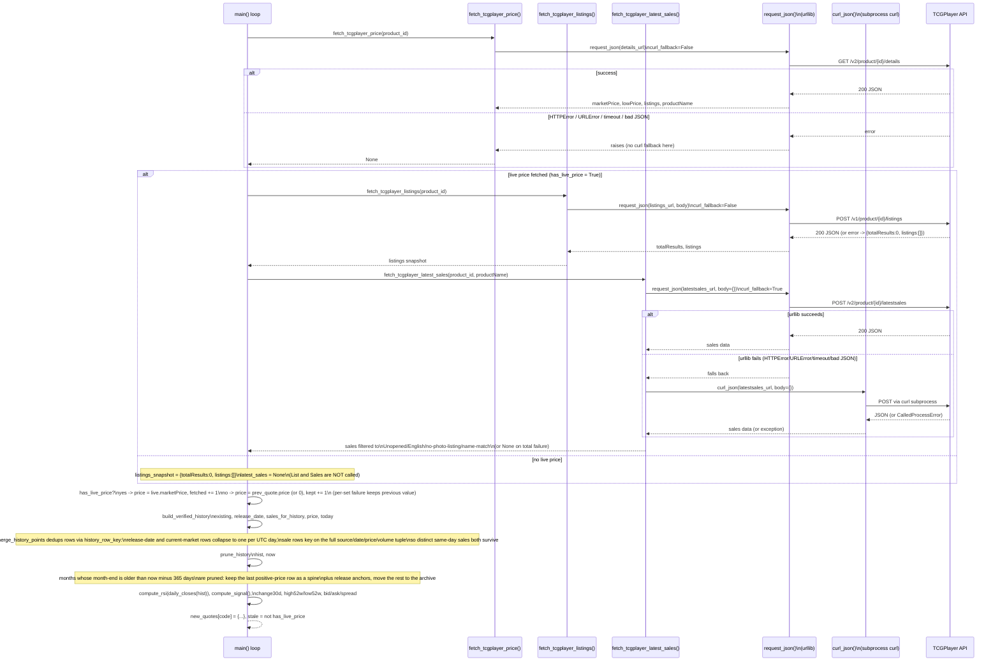

# Sequence Diagram: One Scrape Cycle

One iteration of the `for s in sets:` loop in `scripts/update-prices.py::main()`
(lines 530-615), for a single tracked set. This traces the three TCGPlayer
calls, the fetch-fallback chain (which only exists on one of the three
calls), the per-set-failure fallback, history dedup, and the retention/
archive split.

## Key invariants this diagram encodes

1. **Only one of the three TCGPlayer calls has a curl fallback** —
   `fetch_tcgplayer_latest_sales()` passes `curl_fallback=True` to
   `request_json()` (`update-prices.py:182`); `fetch_tcgplayer_price()` and
   `fetch_tcgplayer_listings()` do not, so a urllib failure there is terminal
   for that call (`update-prices.py:127`, `:168`).
2. **A per-set price-fetch failure never blocks the run.** `has_live_price`
   gates the branch; on failure the set keeps `prev_quote.get('price', 0)`
   and `prev_quote.get('listings', 0)`, increments `kept` instead of
   `fetched`, and the resulting quote is marked `stale: True`
   (`update-prices.py:548-553`, `:612`).
3. **Listings and sales are only fetched when the price fetch succeeded** —
   `fetch_tcgplayer_listings(...) if live else {...}` and
   `fetch_tcgplayer_latest_sales(...) if live else None`
   (`update-prices.py:535-536`).
4. **Dedup is key-based, not date-based.** `history_row_key()` collapses
   `release date` and `tcgplayer current market` rows to one per UTC day
   (repeated hourly runs don't pile up duplicate "current market" points),
   while `tcgplayer latest sale` rows key on the full tuple so two distinct
   sales on the same day both survive (`update-prices.py:308-313`).
5. **Retention is month-granular, not row-granular.** `prune_history()`
   buckets by `YYYY-MM`; a month is only pruned once its month-end falls
   before `now - 365 days`, and pruning keeps exactly one spine row (the
   month's last positive-price row) plus any `release date` anchors —
   everything else in that month moves to `history-archive.json`
   (`update-prices.py:326-356`).
6. **Whole-run failure is refuse-to-write, not partial-write.** If zero
   sets fetched live prices *and* there's no cached positive quote to fall
   back on, or if any tracked set ends up with no quote at all, `main()`
   raises before touching disk (`update-prices.py:621-632`) — the "a failed
   run leaves existing JSON untouched" guarantee from the module docstring.
